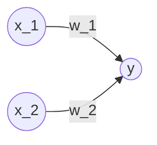
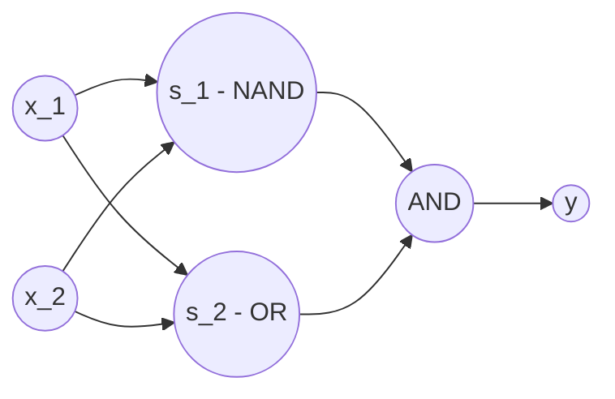
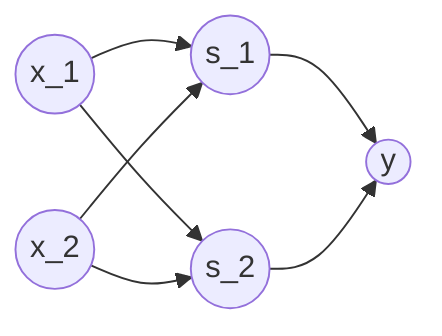
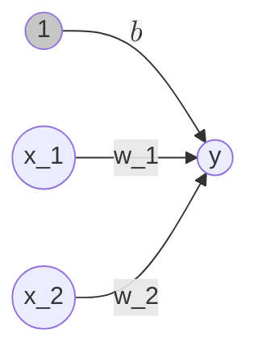
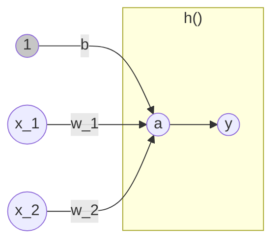
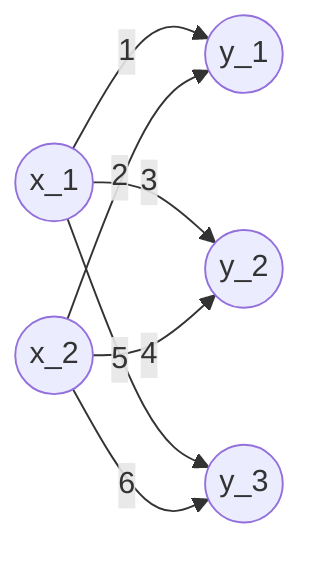
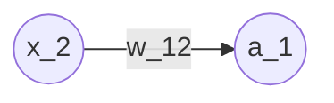
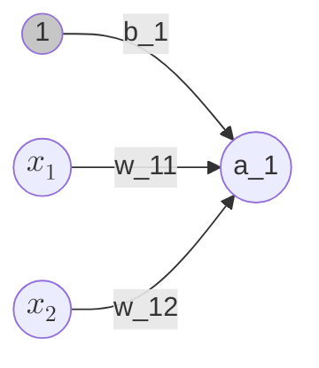

# Machine Learning cheats

Status: Drafting
Audience: Personal
Writer: Kisae Lee
Type of content: Blog, Tech
Start Date: February 25, 2025

# Numpy

행렬연산 도구

---

### 텐서(Tensor)

**정의**: 수학에서는 1차원 배열은 벡터(Vector), 2차원 배열은 행렬(matrix)이라고 함. 이를 일반화한 것을 텐서(Tensor) 라고 함.

벡터의 경우 축의 갯수에 따라 1차원, 2차원 벡터라고 함. 텐서의 경우 벡터의 축의 갯수를 랭크(rank)라고 함(n 랭크 텐서).

### **브로드캐스트(Broadcast)**

**정의**: 형상이 다른 배열끼리 연산이 가능하도록 형상을 확대 후 연산해 주는 기능.

예시

```python
import numpy as np

A = np.array([1,2], [3,4])
B = np.array([10, 20]) 
print(A * B) # Broadcast B to array([10, 20], [10, 20])

# array([10, 40], [30, 80])
```

---

# Matplotlib

그래프 시각화 도구

---

단순 그래프 시각화:

```python
import numpy as np
import matplotlib.pyplot as plt

# Generate data from 0 to 6 with 0.1 interval
x = np.arange(0, 6, 0.1)
# Generate sin value of x
y1 = np.sin(x)
y2 = np.cos(x)

# Draw graph
plt.plot(x, y1, label="sin")
# Draw cos graph with dashed line
plt.plot(x, y2, linestyle="--", label="cos")
plt.xlabel("x")
plt.ylabel("y")
plt.title("sin & cos")
plt.legend()
plt.show()
```

단순 이미지 시각화:

```python
import numpy as np
import matplotlib.pyplot as plt
from matplotlib.image import imread

img = imread("assets/sample_image.jpeg")

plt.imshow(img)
plt.show()
```

---

# 퍼셉트론(Perceptron)

프랑크 로젠블라트(Frank Rosenblatt)가 1957년에 고안한 알고리즘. 신경망(딥러닝)의 기원이 되는 알고리즘.

---

### 정의

퍼셉트론은 다수의 신호를 입력으로 받아 하나의 신호를 출력하는 것.



- $x_1$, $x_2$는 입력 신호, $y$는 출력 신호, $w_1$, $w_2$는 가중치를 뜻함. ($w$는 weight의 머리글자, 가중치는 전류에서 말하는 저항에 해당. 퍼셉트론의 가중치는 그 값이 클수록 강한 신호를 보냄.)
- 그림의 원: 뉴런 혹은 노드라고 칭함.
- 뉴런에서 보내온 신호의 총합이 정해진 한계(임계값, $\theta$)를 넘어설 때만 1을 출력. (뉴런이 활성화한다)
- 동작원리를 수식으로 표현하면 아래와 같다.

$$
y = \begin{cases} 0 (w_1 x_1 + w_2 x_2 <= \theta) \\ 1 (w_1 x_1 + w_2 x_2 > \theta) \end{cases}
$$

### 퍼셉트론과 논리회로

**AND 게이트**

진리표:

| $x_1$ | $x_2$ | $y$ |
| --- | --- | --- |
| 0 | 0 | 0 |
| 1 | 0 | 0 |
| 0 | 1 | 0 |
| 1 | 1 | 1 |

좌측 진리표대로 작동하도록 하는 $w_1$, $w_2$, $\theta$ 값은 (0.5, 0.5, 0.7), (0.5, 0.5, 0.8), (1.0, 1.0, 1.0) 때 모두 만족한다.

**NAND 게이트**

진리표:

| $x_1$ | $x_2$ | $y$ |
| --- | --- | --- |
| 0 | 0 | 1 |
| 1 | 0 | 1 |
| 0 | 1 | 1 |
| 1 | 1 | 0 |

좌측 진리표대로 작동하도록 하는 $w_1$, $w_2$, $\theta$ 값은 AND 게이트의 $w_1$, $w_2$, $\theta$값을 반전하면 된다.

**OR 게이트**

진리표:

| $x_1$ | $x_2$ | $y$ |
| --- | --- | --- |
| 0 | 0 | 0 |
| 1 | 0 | 1 |
| 0 | 1 | 1 |
| 1 | 1 | 1 |

좌측 진리표대로 작동하도록 하는 $w_1$, $w_2$, $\theta$ 값은 (0.5, 0.5, -0.7), (0.5, 0.5, -0.8), (1.0, 1.0, 0.0) 때 모두 만족한다.

기존 임계값 $\theta$ 를 $-b$로 치환한 공식은 아래와 같다. 이 때 $b$ 를 편향(bias)라고 한다.

$$
y = \begin{cases} 0 (b + w_1 x_1 + w_2 x_2 <= 0) \\ 1 (b + w_1 x_1 + w_2 x_2 > 0) \end{cases}
$$

편향, 가중치 공식을 활용하여 AND, NAND, OR 퍼셉트론 구현은 아래와 같다.

```python
import numpy as np

def AND(x1, x2):
    x = np.array([x1, x2])
    w = np.array([0.5, 0.5])
    b = -0.7
    tmp = np.sum(w * x) + b
    if tmp <= 0:
        return 0
    else:
        return 1

def NAND(x1, x2):
    x = np.array([x1, x2])
    w = np.array([-0.5, -0.5])
    b = 0.7
    tmp = np.sum(w * x) + b
    if tmp <= 0:
        return 0
    else:
        return 1

def OR(x1, x2):
    x = np.array([x1, x2])
    w = np.array([0.5, 0.5])
    b = -0.2
    tmp = np.sum(w * x) + b
    if tmp <= 0:
        return 0
    else:
        return 1
```

**XOR 게이트**

진리표:

| $x_1$ | $x_2$ | $y$ |
| --- | --- | --- |
| 0 | 0 | 0 |
| 1 | 0 | 1 |
| 0 | 1 | 1 |
| 1 | 1 | 0 |

XOR 게이트는 퍼셉트론으로 구현할 수 없다. XOR 게이트는 비선형 영역으로 이루어져 있기 때문이다.

### 다층 퍼셉트론(multi-layer perceptron)

XOR 게이트는 AND, NAND, OR 게이트를 조합하여 만들 수 있다.



위 조합을 기준으로 XOR 진리표를 다시 작성하면 아래와 같다.

| $x_1$ | $x_2$ | $s_1$ | $s_2$ | $y$ |
| --- | --- | --- | --- | --- |
| 0 | 0 | 1 | 0 | 0 |
| 1 | 0 | 1 | 1 | 1 |
| 0 | 1 | 1 | 1 | 1 |
| 1 | 1 | 0 | 1 | 0 |

XOR 게이트의 구현은 아래와 같다.

```python
def XOR(x1, x2):
    s1 = NAND(x1, x2)
    s2 = OR(x1, x2)
    y = AND(s1, s2)
    return y
```

즉 XOR 은 다층 구조의 네트워크이며, 2층의 퍼셉트론(다층 퍼셉트론)이라는 것을 알 수 있다.



- 0 층: $x_1$, $x_2$
- 1 층: $s_1$, $s_2$
- 2 층: $y$

과정에 대한 상세 기술:

<aside>

1. 0 층 뉴런이 입력 신호를 받아 1층의 뉴런으로 신호를 보낸다.
2. 1 층 뉴런이 2층의 뉴런으로 신호를 보내고, 2층의 뉴런은 $y$를 출력한다.

작업자들 사이에서 **부품을 전달**하는 일이 이뤄진다.

</aside>

**Key Point:** 

- 단층 퍼셉트론으로는 표현하지 못한 것을 층을 늘려 구현할 수 있다.
- 다층 퍼셉트론은 이론상 컴퓨터를 표현할 수 있다.

# 신경망

신경망은 입력층, 출력층, 은닉층으로 구성된다. 은닉층은 사람 눈에 보이지 않는다.

---

### 퍼셉트론에서 신경망으로


두 신호를 받아 $y$를 출력하는 퍼셉트론. 공식은 아래와 같다.

$$
y = \begin{cases} 0 (b + w_1 x_1 + w_2 x_2 <= 0) \\ 1 (b + w_1 x_1 + w_2 x_2 > 0) \end{cases}
$$

- **편향**: 뉴런이 얼마나 쉽게 활성화되는냐를 제어
- **가중치**: 각 신호의 영향력을 제어

편향을 명시하여 표시한다면 아래와 같다. (편향의 입력 신호는 항상 1 이다)



더 간결한 형태로 식을 작성하면 아래와 같다.

$$
y = h(b + w_1 x_1 + w_2 x_2)
$$

$$
h(x) = \begin{cases} 0 (x<=0) \\ 1 (x > 0) \end{cases}
$$

위 $h(x)$라는 함수는 입력 신호의 총합을 출력 신호로 변환하는 역할을 하며, 일반적으로 이를 **활성함수(activation function)**라 한다.  처리 과정을 세분화해서 표현한 것은 아래와 같다.

$$
\begin{align} a = b + w_1 x_1 + w_2 x_2 \\ y = h(a) \end{align}
$$



### 활성화 함수

아래 식과 같은 활성화 함수는 임계값을 경계로 출력이 바뀜. 이를 **계단 함수**(step function)라 함.

$$
h(x) = \begin{cases} 0 (x<=0) \\ 1 (x > 0) \end{cases}
$$

계단 함수 외 다른 함수로 변경하는 것이 신경망으로 나아가는 열쇠. 신경망에서 자주 이용하는 활성화 함수 - **시그모이드 함수**(sigmoid function)

$$
h(x) = \frac{1}{1 + exp(-x)}
$$

식에서 $exp(-x)$ 은 $e^{-x}$ 를 뜻함. $e$는 자연상수로 2.7182… 값을 갖는 실수.

퍼셉트론과 신경망의 주된 차이는 활성화 함수 뿐.

### 계단 함수 구현

단순한 계단 함수:

```python
import numpy as np

def step_function(x):  # Only takes a number
    if x > 0:
        return 1
    else:
        return

def step_function_array(x):  # It can takes an array
    y = x > 0  # It will compare each element of the array with 0
    return y.astype(np.int_)  # It will convert the boolean array to int array

print(step_function(-1))  # 0
print(step_function_array(np.array([-1.0, 2.0, 3.0])))  # [0 1 1]
```

`astype(dtype)` 함수: 대상 배열 중 모든 요소를 입력한 데이터 타입으로 변환한다.

### 시그모이드 함수 구현

```python
import numpy as np
import matplotlib.pylab as plt

def step_function_array(x):  # It can takes an array
    y = x > 0  # It will compare each element of the array with 0
    return y.astype(np.int_)  # It will convert the boolean array to int array

def sigmoid(x):
    return 1 / (1 + np.exp(-x))

x1 = np.arange(-5.0, 5.0, 0)
y1 = step_function_array(x1)

x2 = np.arange(-5.0, 5.0, 0.1)
y2 = sigmoid(x2)

plt.plot(x1, y1, linestyle="--", label="step")
plt.plot(x2, y2, label="sigmoid")
plt.xlabel("x")
plt.ylabel("y")
plt.legend()
plt.ylim(-0.1, 1.1)
plt.show()
```

계단 함수와 시그모이드 함수 모두 출력은 0~1 사이라는 것은 동일하다.

### 비선형 함수

계단 함수와 시그모이드 함수 모두 비선형 함수이다. 선형함수는 무언가를 입력했을 때 출력이 입력의 상수배만큼 변하는 함수이다. $f(x) = ax + b$ 가 대표적인 선형함수이며, 이때 $a$ 와 $b$ 는 상수다.

<aside>

신경망에서 비선형 함수를 사용하는 이유:

선형함수를 활성화 함수로 채택한 경우의 예: 

- 선형함수: $h(x)=cx$
- 3층 네트워크를 위 선형함수로 대입한 결과: $y(x)=h(h(h(x)))$
- 변환 후: $y(x)=c*c*c*x$
- 이것은 $y(x)=ax$ 와  본질적으로 같음($a=c^3$이라고 한다면).
- 즉 은닉층이 없는 네트워크
</aside>

### ReLU 함수

최근에는 ReLU(Rectified Linear Unit, 렐루) 함수를 주로 이용.

```python
import numpy as np

def relu(x):
    return np.maximum(0, x)
    
x1 = np.arange(-5.0, 5.0, 0.1)
y1 = step_function_array(x1)

x2 = np.arange(-5.0, 5.0, 0.1)
y2 = sigmoid(x2)

x3 = np.arange(-5.0, 5.0, 0.1)
y3 = relu(x3)

plt.plot(x1, y1, linestyle="--", label="step")
plt.plot(x2, y2, label="sigmoid")
plt.plot(x3, y3, label="ReLU")
plt.xlabel("x")
plt.ylabel("y")
plt.legend()
plt.show()
```

$$
h(x) = \begin{cases} 0 (x<=0) \\ x (x > 0) \end{cases}
$$

### 다차원 배열

차원 수 및 다차원 배열의 모양 확인하기

```python
import numpy as np

A = np.array([[1, 2, 3, 4]])
print(np.ndim(A))  # 1. Returns the number of dimensions of the array
print(A.shape)  # (4,). Returns the shape of the array

B = np.array([[1, 2], [3, 4], [5, 6]])
print(np.ndim(B))  # 2
print(B.shape)  # (3, 2)
```

행렬 곱 계산하기 (`np.dot()`)

- `np.dot(A, B)` 와 `np.dot(B, A)` 는 다른 값이 될 수 있다. (행렬곱 공식확인)
- 행렬 곱은 행렬 A 의 1 번째 차원의 원소 수와 행렬 B 의 0번째 차원의 원소 수가 같아야 함.
- 즉, 행렬 A 의 형상이 $(row_A, column_A)$ , 행렬 B 의 형상이 $(row_B, column_B)$ 일 때, $column_A = row_B$ 가 만족되어야 한다.
- 행렬 곱의 결과 C 의 형상은 $(row_A, column_B)$ 가 된다.

```python
A = np.array([[1, 2, 3], [4, 5, 6]])
B = np.array([[1, 2], [3, 4], [5, 6]])
C = np.dot(A, B)
print(C)  # [[22 28] [49 64]]
```

신경망에서의 행렬 곱



위와 같은 신경망 형태에서, X 는 (2,), W 는(2,3), Y는(,3) 형상을 갖는다. 편향과 활성화 함수를 생략하고 가중치만 고려했을 때, Y 값을 계산하는 방법은 아래와 같다.

```python
# In neural network
X = np.array([1, 2])
W = np.array([[1, 3, 5], [2, 4, 6]])
Y = np.dot(X, W)
print(Y)  # [5 11 17]
```

즉 행렬곱을 통해 Y 는 한 번의 연산으로 계산가능하다.

## 신경망 구현하기



$$
w^{(1)}_{12}
$$

- $(1)$: 1 층에 가중치라는 의미
- $1$: 다음 층 뉴런의 번호 (다음 층 1 번째 뉴런)
- $2$: 앞 층 뉴런의 번호 (앞 층 2 번째 뉴런)

편향을 포함했을 때의 관계도는 아래와 같음($a_2$, $a_3$ 는 귀찮아서 그리지 않음)



$a^{(1)}_{1}$의 값을 계산하는 공식:

$$
a^{(1)}_{1} = w^{(1)}_{11}x_1 + w^{(1)}_{12}x2 + b^{(1)}_{1}
$$

행렬 곱으로 전환 후,

$$
A^{(1)} = XW^{(1)} + B(1)
$$

이때, 각 행렬은 아래와 같음

$$
A^{(1)} = (a^{(1)}_{1}, a^{(1)}_{2}, a^{(1)}_{3}), X = (x_1, x_2), B^{(1)} = (b^{(1)}_{1}, b^{(1)}_{2}, b^{(1)}_{3})
$$

$$
W^{(1)} = \begin{pmatrix} w^{(1)}_{11} & w^{(1)}_{21} & w^{(1)}_{31}\\ w^{(1)}_{12} & w^{(1)}_{22} & w^{(1)}_{32}\end{pmatrix}
$$

이것을 절차지향적으로 구현한 결과는 아래과 같음

```python
import numpy as np

def sigmoid(x):
    return 1 / (1 + np.exp(-x))

# this function is not doing anything
# in this specific case
def identity_function(x):
    return x

# input layer to level 1
X = np.array([1.0, 0.5])
W1 = np.array([[0.1, 0.3, 0.5], [0.2, 0.4, 0.6]])
B1 = np.array([0.1, 0.2, 0.3])

A1 = np.dot(X, W1) + B1
Z1 = sigmoid(A1)
print(Z1)  # [0.57444252 0.66818777 0.75026011]

# level 1 to level 2
W2 = np.array([[0.1, 0.4], [0.2, 0.5], [0.3, 0.6]])
B2 = np.array([0.1, 0.2])

A2 = np.dot(Z1, W2) + B2
Z2 = sigmoid(A2)
print(Z2)  # [0.62624937 0.7710107]

# level 2 to output layer
W3 = np.array([[0.1, 0.3], [0.2, 0.4]])
B3 = np.array([0.1, 0.2])

A3 = np.dot(Z2, W3) + B3
Y = identity_function(A3)
print(Y)  # [0.31682708 0.69627909]
```

위 구현을 정리하면 아래와 같음

```python
import numpy as np

def sigmoid(x):
    return 1 / (1 + np.exp(-x))

# this function is not doing anything
# in this specific case
def identity_function(x):
    return x

def init_network():  # return a network with 2 inputs
    network = {}
    network["W1"] = np.array([[0.1, 0.3, 0.5], [0.2, 0.4, 0.6]])
    network["b1"] = np.array([0.1, 0.2, 0.3])
    network["W2"] = np.array([[0.1, 0.4], [0.2, 0.5], [0.3, 0.6]])
    network["b2"] = np.array([0.1, 0.2])
    network["W3"] = np.array([[0.1, 0.3], [0.2, 0.4]])
    network["b3"] = np.array([0.1, 0.2])

    return network

def forward(network, x):
    W1, W2, W3 = network["W1"], network["W2"], network["W3"]
    b1, b2, b3 = network["b1"], network["b2"], network["b3"]

    a1 = np.dot(x, W1) + b1
    z1 = sigmoid(a1)
    a2 = np.dot(z1, W2) + b2
    z2 = sigmoid(a2)
    a3 = np.dot(z2, W3) + b3
    y = identity_function(a3)

    return y

network = init_network()
x = np.array([1.0, 0.5])
y = forward(network, x)
print(y)  # [0.31682708 0.69627909]
```

## 출력층 설계하기

기계학습 문제는 **분류**(classification)와 **회귀**(regression)로 나뉨. 사진 속 인물의 성별을 분류하는 문제는 ‘분류’, 사진 속 인물의 몸무게를 예측하는 문제는 ‘회귀’.

일반적으로 ‘회귀’에는 **항등 함수**(identify function)을 사용. 항등 함수는 입력을 그대로 출력함. ‘항등’은 입력과 출력이 항상 같다는 의미.

‘분류’에는 **소프트맥스 함수**(softmax function) 을 사용. 식은 다음과 같음.

$$
y_k=\frac{exp(a_k)}{\sum_{i=1}^n exp(a_i)}
$$

소프트맥스 함수의 구현은 다음과 같음.

```python
import numpy as np

def softmax(a):  # this will overflow
    exp_a = np.exp(a)
    sum_exp_a = np.sum(exp_a)
    y = exp_a / sum_exp_a
    return y
```

다만, 소프트맥스 함수는 지수함수를 사용하여, 엄청 큰 값을 리턴할 수 있음. 또한 이러한 큰 값끼리 나눗셈을 할 경우 결과 수치가 불안정해짐. 이 때, 소프트맥스 함수를 아래와 같이 개선하여 구현하면 오버플로 문제를 해결할 수 있음.

$$
y_k=\frac{exp(a_k-C')}{\sum_{i=1}^n exp(a_i-C')}
$$

그 구현은 아래와 같음.

```python
import numpy as np

def softmax_modified(a):  # this will not overflow
    c = np.max(a)
    exp_a = np.exp(a - c)
    sum_exp_a = np.sum(exp_a)
    y = exp_a / sum_exp_a
    return y
```

- 소프트맥스 함수의 성질: 출력은 0.0~1.0 사이 실수이며, 출력의 총 합은 1. 즉, 소프트맥스 함수의 출력을 ‘확률’로 해석할 수 있음.
- ‘분류’ 문제에서, 은닉층의 마지막 층 원소의 대소 관계와, 소프트맥스 함수를 통해 계산된 출력층 원소의 대소 관계는 동일함으로 굳이 소프트맥스 함수를 통해 추가 계산하지 않음.

## 손글씨 숫자 인식

학습과정은 생략하고, 추론과정만 구현. 이 추론 과정을 신경망의 **순전파**(forward propagation) 이라고 함.

<aside>

MNIST 데이터 가져오기:

- tensorflow 를 통한 MNIST 가져오기 (딱봐도 이게 좋다)

```python
# pip install tensorflow
# Better! load the MNIST dataset using tensorflow
import keras

import keras
import matplotlib.pyplot as plt

Mnist = keras.datasets.mnist
(x_train, t_train), (x_test, t_test) = Mnist.load_data()

print(x_train.shape, t_train.shape)
print(x_test.shape, t_test.shape)

for i in range(9):
    plt.subplot(3, 3, i + 1)
    plt.tight_layout()
    plt.imshow(x_train[i].reshape(28, 28), cmap="gray", interpolation="none")
    plt.title("digit: {}".format(t_train[i]))
    plt.xticks([])
    plt.yticks([])

plt.show()
```

- pytorch 를 통한 MNIST 가져오기

```python
# pip install torch
# pip install torchvision
from torchvision import datasets
from torchvision.transforms import ToTensor
from torch.utils.data import DataLoader

# Load the MNIST dataset using torchvision.datasets
BATCH_SIZE = 32
train_set = datasets.MNIST(
    root="./mnist", train=True, transform=ToTensor(), download=True
)

test_set = datasets.MNIST(
    root="./mnist", train=False, transform=ToTensor(), download=True
)

print(len(train_set))

train_loader = DataLoader(dataset=train_set, batch_size=BATCH_SIZE, shuffle=True)
test_loader = DataLoader(dataset=test_set, batch_size=BATCH_SIZE, shuffle=False)

for x_train, t_train in train_loader:
    for i in range(9):
        plt.subplot(3, 3, i + 1)
        plt.tight_layout()
        plt.imshow(x_train[i].reshape(28, 28), cmap="gray", interpolation="none")
        plt.title("digit: {}".format(t_train[i]))
        plt.xticks([])
        plt.yticks([])

    plt.show()
    break
```

</aside>

### 신경망 추론 처리

```python
import keras
import numpy as np
import pickle

def sigmoid(x):
    return 1 / (1 + np.exp(-x))

def softmax(a):
    c = np.max(a)
    exp_a = np.exp(a - c)
    sum_exp_a = np.sum(exp_a)
    y = exp_a / sum_exp_a
    return y

def get_data():
    Mnist = keras.datasets.mnist
    (x_train, t_train), (x_test, t_test) = Mnist.load_data()
    # Normalize the image data
    return x_test.reshape([-1, 28 * 28]) / 255, t_test

def init_network():
    with open("assets/sample_weight.pkl", "rb") as f:
        network = pickle.load(f)

    return network

def predict(network, x):
    W1, W2, W3 = network["W1"], network["W2"], network["W3"]
    b1, b2, b3 = network["b1"], network["b2"], network["b3"]

    a1 = np.dot(x, W1) + b1
    z1 = sigmoid(a1)
    a2 = np.dot(z1, W2) + b2
    z2 = sigmoid(a2)
    a3 = np.dot(z2, W3) + b3
    y = softmax(a3)

    return y

x, t = get_data()
network = init_network()

accuracy_cnt = 0
for i in range(len(x)):
    y = predict(network, x[i].flatten())
    p = np.argmax(y)
    if p == t[i]:
        accuracy_cnt += 1

print("Accuracy: " + str(float(accuracy_cnt) / len(x)))
```

- 정확도: 0.9352
- 여기서 0 ~ 255 범위인 픽셀의 값을 0.0 ~ 1.0 범위로 변환했다(안하면 시그모이드 함수에서 오버플로가 난다). 이러한 변환을 **정규화**(normalization)라고 한다.
- 이렇게 신경망의 입력 데이터 특정 변환을 가하는 것을 **전처리**(pre-processing)라 한다. ‘정규화’는 ‘전처리’ 작업 중 하나이다.

### 배치처리(묶음처리)

```python
batch_size = 100
for i in range(0, len(x), batch_size):
    x_batch = x[i : i + batch_size]
    y_batch = predict(network, x_batch)
    p = np.argmax(y_batch, axis=1)
    accuracy_cnt += np.sum(p == t[i : i + batch_size])

print("Accuracy: " + str(float(accuracy_cnt) / len(x)))
```
