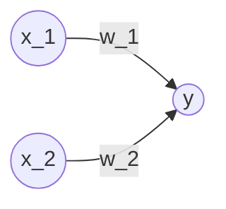
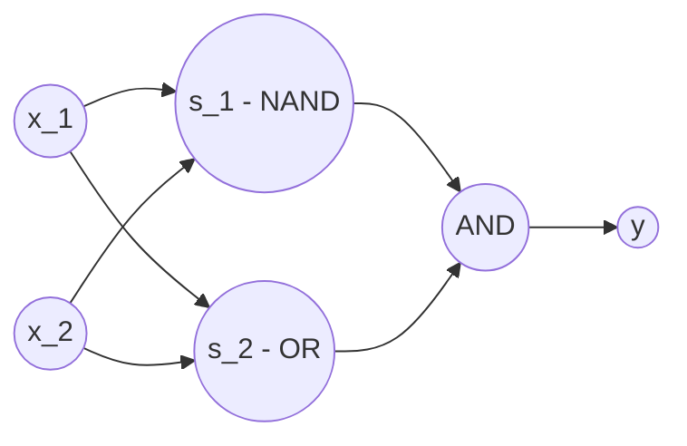
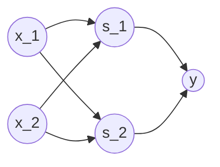
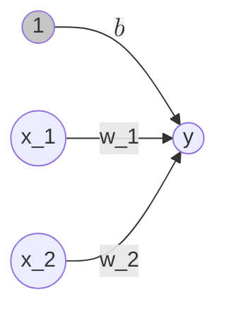
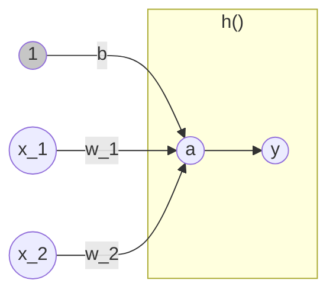

# Machine Learning cheats

Status: Drafting
Audience: Personal
Writer: Kisae Lee
Type of content: Blog, Tech
Start Date: February 25, 2025

# Numpy

행렬연산 도구

---

### 텐서(Tensor)

**정의**: 수학에서는 1차원 배열은 벡터(Vector), 2차원 배열은 행렬(matrix)이라고 함. 이를 일반화한 것을 텐서(Tensor) 라고 함.

벡터의 경우 축의 갯수에 따라 1차원, 2차원 벡터라고 함. 텐서의 경우 벡터의 축의 갯수를 랭크(rank)라고 함(n 랭크 텐서).

### **브로드캐스트(Broadcast)**

**정의**: 형상이 다른 배열끼리 연산이 가능하도록 형상을 확대 후 연산해 주는 기능.

예시

```python
import numpy as np

A = np.array([1,2], [3,4])
B = np.array([10, 20]) 
print(A * B) # Broadcast B to array([10, 20], [10, 20])

# array([10, 40], [30, 80])
```

---

# Matplotlib

그래프 시각화 도구

---

단순 그래프 시각화:

```python
import numpy as np
import matplotlib.pyplot as plt

# Generate data from 0 to 6 with 0.1 interval
x = np.arange(0, 6, 0.1)
# Generate sin value of x
y1 = np.sin(x)
y2 = np.cos(x)

# Draw graph
plt.plot(x, y1, label="sin")
# Draw cos graph with dashed line
plt.plot(x, y2, linestyle="--", label="cos")
plt.xlabel("x")
plt.ylabel("y")
plt.title("sin & cos")
plt.legend()
plt.show()
```

단순 이미지 시각화:

```python
import numpy as np
import matplotlib.pyplot as plt
from matplotlib.image import imread

img = imread("assets/sample_image.jpeg")

plt.imshow(img)
plt.show()
```

---

# 퍼셉트론(Perceptron)

프랑크 로젠블라트(Frank Rosenblatt)가 1957년에 고안한 알고리즘. 신경망(딥러닝)의 기원이 되는 알고리즘.

---

### 정의

퍼셉트론은 다수의 신호를 입력으로 받아 하나의 신호를 출력하는 것.



- $x_1$, $x_2$는 입력 신호, $y$는 출력 신호, $w_1$, $w_2$는 가중치를 뜻함. ($w$는 weight의 머리글자, 가중치는 전류에서 말하는 저항에 해당. 퍼셉트론의 가중치는 그 값이 클수록 강한 신호를 보냄.)
- 그림의 원: 뉴런 혹은 노드라고 칭함.
- 뉴런에서 보내온 신호의 총합이 정해진 한계(임계값, $\theta$)를 넘어설 때만 1을 출력. (뉴런이 활성화한다)
- 동작원리를 수식으로 표현하면 아래와 같다.

$$
y = \begin{cases} 0 (w_1 x_1 + w_2 x_2 <= \theta) \\ 1 (w_1 x_1 + w_2 x_2 > \theta) \end{cases}
$$

### 퍼셉트론과 논리회로

**AND 게이트**

진리표:

| $x_1$ | $x_2$ | $y$ |
| --- | --- | --- |
| 0 | 0 | 0 |
| 1 | 0 | 0 |
| 0 | 1 | 0 |
| 1 | 1 | 1 |

좌측 진리표대로 작동하도록 하는 $w_1$, $w_2$, $\theta$ 값은 (0.5, 0.5, 0.7), (0.5, 0.5, 0.8), (1.0, 1.0, 1.0) 때 모두 만족한다.

**NAND 게이트**

진리표:

| $x_1$ | $x_2$ | $y$ |
| --- | --- | --- |
| 0 | 0 | 1 |
| 1 | 0 | 1 |
| 0 | 1 | 1 |
| 1 | 1 | 0 |

좌측 진리표대로 작동하도록 하는 $w_1$, $w_2$, $\theta$ 값은 AND 게이트의 $w_1$, $w_2$, $\theta$값을 반전하면 된다.

**OR 게이트**

진리표:

| $x_1$ | $x_2$ | $y$ |
| --- | --- | --- |
| 0 | 0 | 0 |
| 1 | 0 | 1 |
| 0 | 1 | 1 |
| 1 | 1 | 1 |

좌측 진리표대로 작동하도록 하는 $w_1$, $w_2$, $\theta$ 값은 (0.5, 0.5, -0.7), (0.5, 0.5, -0.8), (1.0, 1.0, 0.0) 때 모두 만족한다.

기존 임계값 $\theta$ 를 $-b$로 치환한 공식은 아래와 같다. 이 때 $b$ 를 편향(bias)라고 한다.

$$
y = \begin{cases} 0 (b + w_1 x_1 + w_2 x_2 <= 0) \\ 1 (b + w_1 x_1 + w_2 x_2 > 0) \end{cases}
$$

편향, 가중치 공식을 활용하여 AND, NAND, OR 퍼셉트론 구현은 아래와 같다.

```python
import numpy as np

def AND(x1, x2):
    x = np.array([x1, x2])
    w = np.array([0.5, 0.5])
    b = -0.7
    tmp = np.sum(w * x) + b
    if tmp <= 0:
        return 0
    else:
        return 1

def NAND(x1, x2):
    x = np.array([x1, x2])
    w = np.array([-0.5, -0.5])
    b = 0.7
    tmp = np.sum(w * x) + b
    if tmp <= 0:
        return 0
    else:
        return 1

def OR(x1, x2):
    x = np.array([x1, x2])
    w = np.array([0.5, 0.5])
    b = -0.2
    tmp = np.sum(w * x) + b
    if tmp <= 0:
        return 0
    else:
        return 1
```

**XOR 게이트**

진리표:

| $x_1$ | $x_2$ | $y$ |
| --- | --- | --- |
| 0 | 0 | 0 |
| 1 | 0 | 1 |
| 0 | 1 | 1 |
| 1 | 1 | 0 |

XOR 게이트는 퍼셉트론으로 구현할 수 없다. XOR 게이트는 비선형 영역으로 이루어져 있기 때문이다.

### 다층 퍼셉트론(multi-layer perceptron)

XOR 게이트는 AND, NAND, OR 게이트를 조합하여 만들 수 있다.



위 조합을 기준으로 XOR 진리표를 다시 작성하면 아래와 같다.

| $x_1$ | $x_2$ | $s_1$ | $s_2$ | $y$ |
| --- | --- | --- | --- | --- |
| 0 | 0 | 1 | 0 | 0 |
| 1 | 0 | 1 | 1 | 1 |
| 0 | 1 | 1 | 1 | 1 |
| 1 | 1 | 0 | 1 | 0 |

XOR 게이트의 구현은 아래와 같다.

```python
def XOR(x1, x2):
    s1 = NAND(x1, x2)
    s2 = OR(x1, x2)
    y = AND(s1, s2)
    return y
```

즉 XOR 은 다층 구조의 네트워크이며, 2층의 퍼셉트론(다층 퍼셉트론)이라는 것을 알 수 있다.



- 0 층: $x_1$, $x_2$
- 1 층: $s_1$, $s_2$
- 2 층: $y$

과정에 대한 상세 기술:

<aside>

1. 0 층 뉴런이 입력 신호를 받아 1층의 뉴런으로 신호를 보낸다.
2. 1 층 뉴런이 2층의 뉴런으로 신호를 보내고, 2층의 뉴런은 $y$를 출력한다.

작업자들 사이에서 **부품을 전달**하는 일이 이뤄진다.

</aside>

**Key Point:** 

- 단층 퍼셉트론으로는 표현하지 못한 것을 층을 늘려 구현할 수 있다.
- 다층 퍼셉트론은 이론상 컴퓨터를 표현할 수 있다.

# 신경망

신경망은 입력층, 출력층, 은닉층으로 구성된다. 은닉층은 사람 눈에 보이지 않는다.

---

### 퍼셉트론에서 신경망으로


두 신호를 받아 $y$를 출력하는 퍼셉트론. 공식은 아래와 같다.

$$
y = \begin{cases} 0 (b + w_1 x_1 + w_2 x_2 <= 0) \\ 1 (b + w_1 x_1 + w_2 x_2 > 0) \end{cases}
$$

- **편향**: 뉴런이 얼마나 쉽게 활성화되는냐를 제어
- **가중치**: 각 신호의 영향력을 제어

편향을 명시하여 표시한다면 아래와 같다. (편향의 입력 신호는 항상 1 이다)



더 간결한 형태로 식을 작성하면 아래와 같다.

$$
y = h(b + w_1 x_1 + w_2 x_2)
$$

$$
h(x) = \begin{cases} 0 (x<=0) \\ 1 (x > 0) \end{cases}
$$

위 $h(x)$라는 함수는 입력 신호의 총합을 출력 신호로 변환하는 역할을 하며, 일반적으로 이를 **활성함수(activation function)**라 한다.  처리 과정을 세분화해서 표현한 것은 아래와 같다.

$$
\begin{align} a = b + w_1 x_1 + w_2 x_2 \\ y = h(a) \end{align}
$$



### 활성화 함수

아래 식과 같은 활성화 함수는 임계값을 경계로 출력이 바뀜. 이를 **계단 함수**(step function)라 함.

$$
h(x) = \begin{cases} 0 (x<=0) \\ 1 (x > 0) \end{cases}
$$

계단 함수 외 다른 함수로 변경하는 것이 신경망으로 나아가는 열쇠. 신경망에서 자주 이용하는 활성화 함수 - **시그모이드 함수**(sigmoid function)

$$
h(x) = \frac{1}{1 + exp(-x)}
$$

식에서 $exp(-x)$ 은 $e^{-x}$ 를 뜻함. $e$는 자연상수로 2.7182… 값을 갖는 실수.
